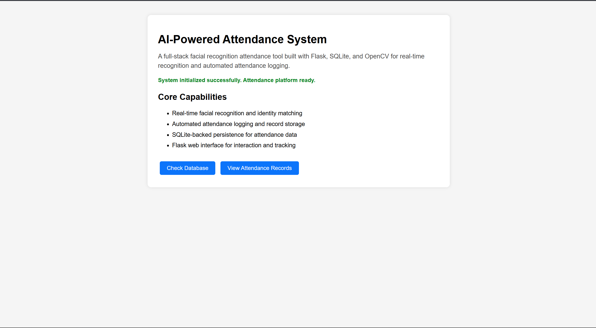
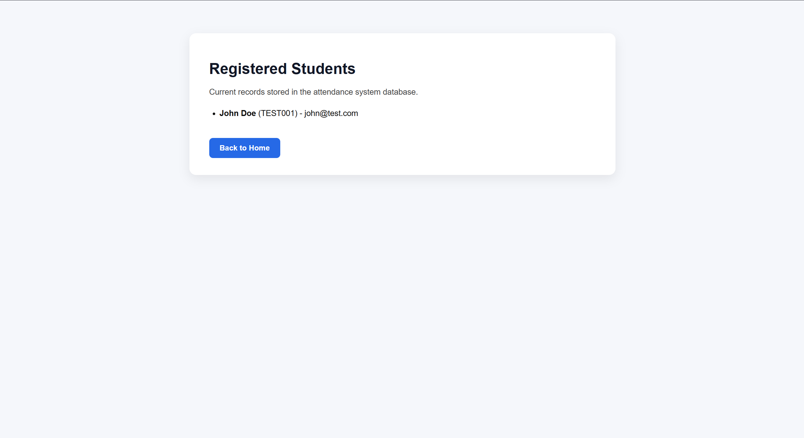

# AI Attendance System

AI Attendance System is a full-stack facial recognition attendance application built with Python, OpenCV, Flask, and SQLite. It identifies users in real time from a live camera feed and automatically logs attendance records through a web-based interface.

## Why I Built It

I built this project to explore how computer vision can be applied to a practical workflow that many schools, labs, and organizations still handle manually. The goal was to create a system that could identify users from a live video stream and automatically record attendance in a structured and searchable format.

## Features

- Real-time face detection and recognition
- Automated attendance logging
- Live video processing through a web application
- SQLite-backed storage for attendance records
- Web interface for viewing and managing attendance data

## Tech Stack

- Python
- OpenCV
- Flask
- SQLite
- HTML/CSS

## My Contribution

I built the system end to end, including:
- Face detection and recognition workflow
- Attendance logging logic
- Flask backend and routing
- Database integration with SQLite
- Web interface for interacting with attendance data

## Outcome

The project gave me hands-on experience combining computer vision, backend engineering, and data storage into a practical product workflow.

## Demo Screens

### Live Recognition

### Attendance Log

## How to Run

1. Clone the repository  
2. Install dependencies from `requirements.txt`  
3. Run the Flask app  
4. Open the local web interface and start attendance tracking  

## Future Improvements

- Better face embedding and recognition accuracy
- User management and admin authentication
- Cloud database and deployment support
- Better handling for multiple concurrent users
- Analytics dashboard for attendance trends
